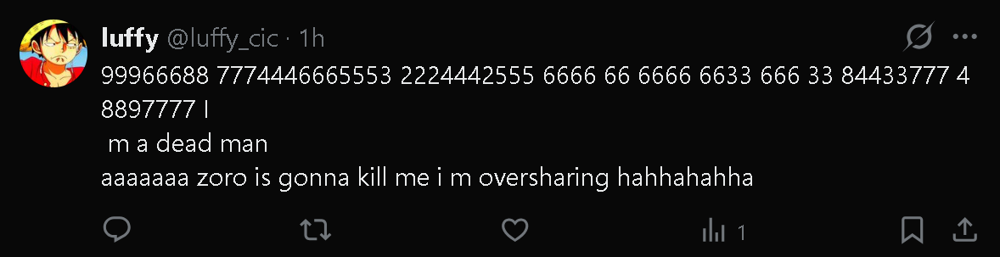
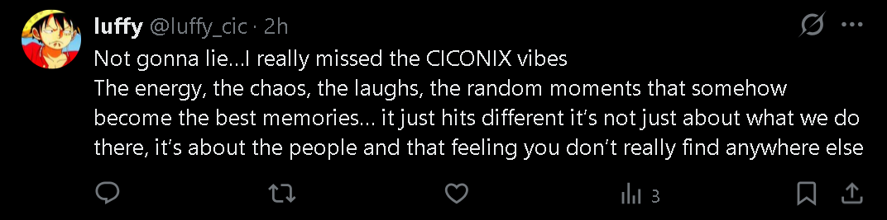
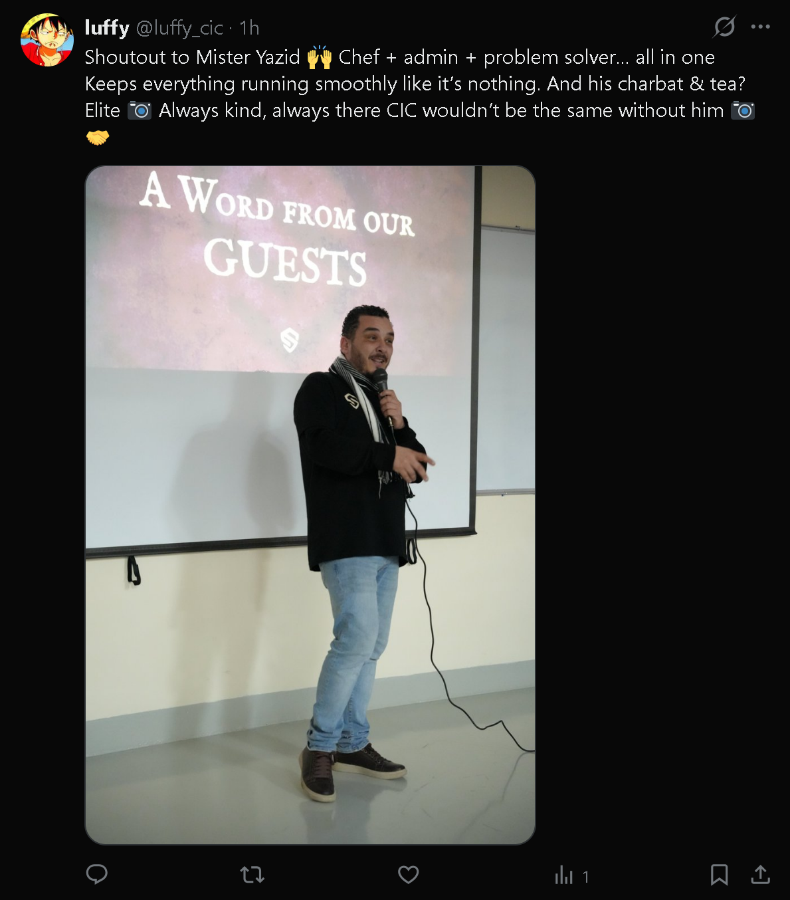
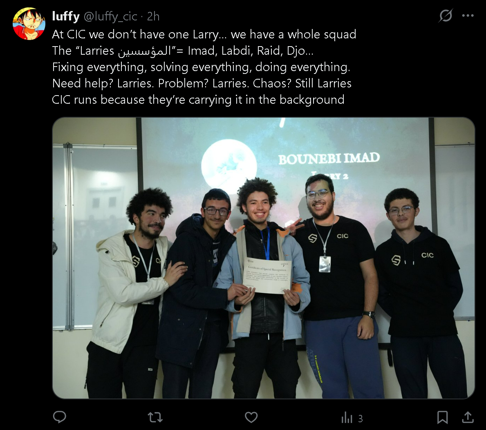
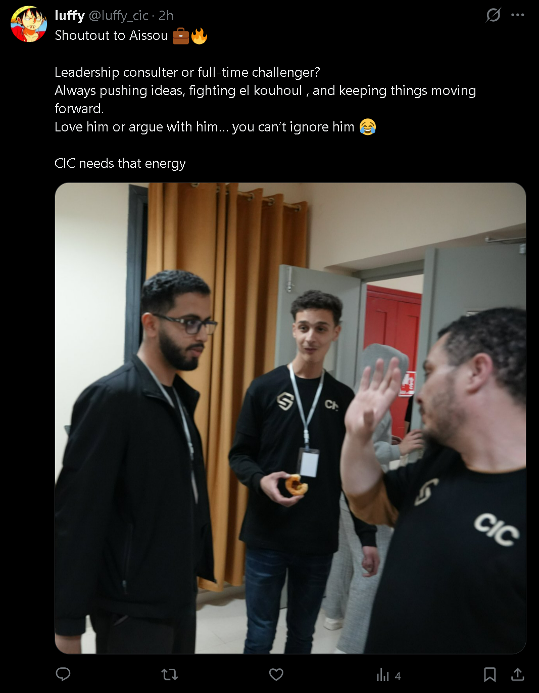

# The Art of Saying Too Much
### A Profile of @luffy_cic — The Account That Overshares So You Don't Have To

*Internet Culture · X / Twitter · April 2026 · CIC, Oran*

---

There is a particular type of person on the internet — and you almost certainly know one — who treats social media not as a stage, but as a diary left open on a café table. Every thought, every feeling, every mundane observation gets posted. Not with malice. Not even with full awareness. Just... posted. Immediately. Enthusiastically. Repeatedly.

Meet **luffy (@luffy_cic)**. A brand new account — joined April 2026 — with 7 posts, 1 following, 0 followers, and already, unmistakably, the energy of someone who has absolutely no intention of slowing down.

| Stat | Value |
|------|-------|
| Total Posts | 7 |
| Followers | 0 |
| Following | 1 |
| Account age at time of posting | ~1–2 hours |

---

## The First Confession

The account's most revealing post — and arguably its thesis statement came within the first hour of existence (dar karitha ):

---

## The Nostalgia Drop

Before the shoutout spree began, luffy paused for a moment of genuine vulnerability:

**CICONIX** appears to be an event likely a tech hackathone run by or affiliated with CIC. This post is the emotional engine behind everything that follows. It reframes the entire account: luffy isn't just randomly oversharing. They're processing nostalgia in real time, publicly, for a community they clearly love. The shoutouts that follow aren't content they're a love letter, posted one person at a time.

Three views on this one. The audience is growing. Slowly(but i ve catched that )

---

## The Shoutout Machine

Having established the emotional stakes, luffy launched into a series of appreciation posts each one accompanied by actual photos, which escalates the oversharing from "diary entry" to "unauthorized documentary."

---

### Chapter 1: Mister Yazid

The attached photo shows Mister Yazid at a podium in front of a projection screen reading **"A Word From Our Guests"** — microphone in hand, clearly mid-speech at a CIC event. He looks composed and completely unaware that he is about to become the subject of an internet appreciation post watched by exactly one person.

**Analysis:** The tea gets its own sentence. This is the mark of someone who truly means what they say.

---

### Chapter 2: The Larries المؤسسين

Five posing together at what appears to be a CICONIX award ceremony. One of them **Bounebi Imad**, whose name is visible on the projection screen is holding a **Certificate of Special Recognition**. They are all wearing CIC hoodies and lanyards. They look genuinely happy.

**Analysis:** The crying emoji after "whole squad" and after "Still Larries" is doing enormous emotional work. The Larries are not just a maintenance crew they are, in luffy's telling, the silent backbone of an entire community. Being named specifically on a brand new account with no audience is both an honour and a mild privacy hazard.

---

### Chapter 3: Aissou

Three men in conversation two in CIC-branded black hoodies with lanyards, one gesturing expressively mid-point (Aissou). The composition accidentally captures the energy of the caption perfectly: someone is absolutely in the middle of challenging something.

**Analysis:** "Love him or argue with him… you can't ignore him" is one of the most accurate character descriptions ever written in a tweet. At 4 views, this is the most-watched post on the account. Aissou's chaotic energy is, statistically, the most compelling content here.

---

## The View Count Problem (That Isn't Really a Problem)

| Post | Views |
|------|-------|
| T9 confession / "I m oversharing" | 1 |
| Mister Yazid shoutout | 1 |
| CICONIX nostalgia | 3 |
| The Larries | 3 |
| Aissou shoutout | 4 |

An account posting for a total audience that could fit in a single elevator and yet posting with the urgency and sincerity of a viral thread. There is no performance here. No optimisation for reach. The posts go out because they need to go out. This is perhaps the purest form of social media that exists.

---

## What Makes an Oversharer?

Oversharing online is often misunderstood. It's rarely about attention-seeking in the cynical sense. More often, it's a collision between two very human impulses: the need to express, and a complete disregard for the imagined audience. The oversharer does not ask *"should I post this?"* They ask *"where is the post button?"*

What makes @luffy_cic a textbook case — and an endearing one — is the total absence of curation. There is no brand strategy here. No content calendar. Just a person sitting somewhere in Oran, Algeria, heart full of feelings about the people at CIC, fingers on a keyboard, and zero filter between the two.

The photos make it worse (better). Anyone else would have kept the shoutouts abstract. Luffy attached evidence. Mister Yazid at the microphone. The Larries holding a certificate. Aissou mid-argument. The internet has now been given a visual record of a community it didn't know existed an hour ago.

---

## The Luffy Connection

The username *luffy_cic* — is not accidental. Monkey D. Luffy, the protagonist of *One Piece*, is defined by exactly one character trait above all others: he cannot hide what he feels, and he doesn't try. He charges forward, heart first, consequence second. He names his crew, praises his friends loudly, and would absolutely post a T9 message by mistake and then laugh about it.

The profile picture confirms it. It's Luffy. Of course it is.

In the manga, Zoro is the crew's straight-man — the one who sighs while Luffy does something chaotic and earnest. The self-cast roles here are perfect.

---

## A Love Letter to the Unfiltered

In an era of carefully crafted personal brands and anxiously optimised content, there is something genuinely refreshing about an account that starts with an accidental overshare, announces its own oversharing, and then continues to overshare with full commitment — complete with photos, names, and a nostalgia post about an event called CICONIX.

@luffy_cic is not performing authenticity. They are just being authentic, loudly, in public, to a maximum audience of four people.

Zoro is, apparently, going to kill them for it. We look forward to the post about that too.

---

